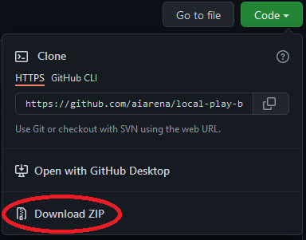

# local-play-bootstrap

## What is this?
This repo intends to be a pain-free method for SC2 AI bot authors to quickly setup and run local bot matches on their system, using the same set of docker images that the [SC2 AI Arena ladder](https://sc2ai.net) runs on.

## Prerequisites

This bootstrap requires Docker Compose to run.  

If you've installed Docker on Windows or MacOS then Docker Compose is already installed.  
For other systems: [How to install Docker Compose](https://docs.docker.com/compose/install/)

## Getting started

### Download this repo

### Validating your setup

A test match between 2 included test bots along with the map BerlingradAIE is preconfigured to run in the `matches` file.

You can run the test match by executing `docker-compose up` in the base folder of this repo.

## Running your own matches

1. Put your bots in the `./bots` folder.
2. Download the [latest ladder maps](https://sc2ai.net//wiki/maps/#wiki-toc-current-map-pool) and place them in this repo's local `./maps` folder.  
   See [Use an alternative maps folder location](#use-an-alternative-maps-folder-location) if you want to use a different maps folder.
2. Add the relevant entries for matches you wish to play to the `matches` file.
3. Run `docker compose up` to run the matches.
4. View results in the `results.json` file and replays in the `replays` folder.

### Multi-threaded matches

Refer to [multithread-example.py](./multithread-example.py) for an example of how to run multiple matches in parallel.

Note that there are aspects of bot games that would need more work to be thread safe, 
such as bots which save data to their data folder.

## Troubleshooting
All container and bot logs can be found in the `logs` folder.

Docker container output can also be seen after running the `docker compose up` command.  
You can also revisit the container output of previous runs by running `docker compose logs`.

## Use an alternative maps folder location
It can sometimes be handy to have your maps in another location e.g. if you want to use the same maps folder as your StarCraft II installation.  

To do this, update the SC2 Maps Path setting in the docker-compose.yml file to point to your maps folder.

## Contribute
If you notice issues with setup, or have ideas that might help other bot authors, please feel free to contribute via a pull request.

## License

Copyright (c) 2022

Licensed under the [GPLv3 license](LICENSE).
